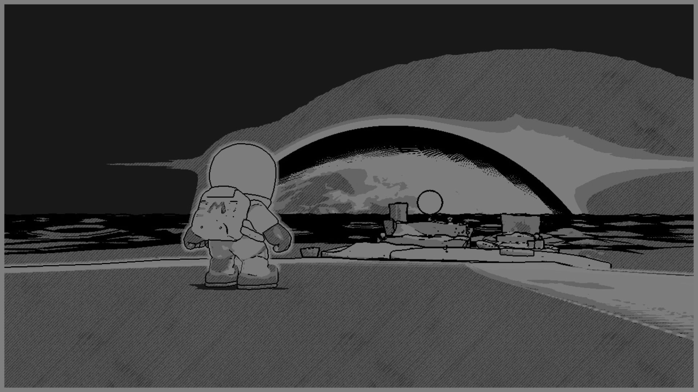

# SMO Shaders

## Overview
This repository contains a Unity project that emulates the shaders found in Super Mario Odyssey's Snapshot Mode. Inside the `Shaders` folder, there is a collection of template shader files, alongside a folder called `Complete` which contains finished and commented versions of all of those shader files. The reader is intended to follow the Image Effects tutorial series found on https://danielilett.com/, which outlines how each of the shaders work.

### Shaders Included
Several shaders are included in this project, corresponding to the following Snapshot Mode effects:
- Greyscale;
- Sepia-tone;
- Silhouette;
- Blur;
- Line Drawing;
- Neon.

## Software
The project was created using Unity 2019.2.0a9, but it should be possible to upgrade or downgrade to other versions of Unity.

## Assets
This project uses the following assets:
- ["Single Street Lamp" by Christopher Fisher](https://assetstore.unity.com/packages/3d/environments/urban/single-street-lamp-121728);
- ["Bench" by IL.RANCH](https://assetstore.unity.com/packages/3d/props/exterior/bench-75025).

## Authors
These shaders, and the corresponding tutorial series, were written by [Daniel Ilett](https://github.com/daniel-ilett).

## Release
The shader collection was released on April 24th alongside the introduction of the tutorial series.

Thanks for reading my tutorials.

❤
